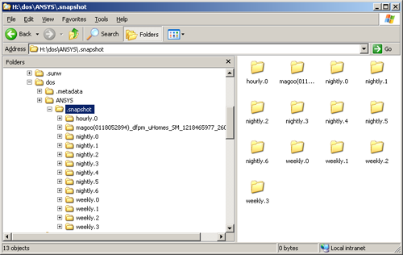

<!-- The importance of and techniques for managing large scale on-line and near-line data storage.
Digital images and manipulation techniques. -->

Whether for streaming lossless 4k 32-bit EXRs or reading 500 gigabyte alembic caches, VFX studios require special and expensive infrastructure to enable working efficiently with such large amounts of data. They need to ensure that there is plenty of disk space for data, that there are reliable snapshot backup and archiving systems, that it is all accessible via a speedy network and that it is all protected by a hefty firewall.

Types of Storage
-------------

### Online

This is data that is available to access instantaneously, over a network.

### Nearline

Nearline storage is an intermediate between "online" and "offline" storage. It includes any data that is only online and available to access on request. It is much more power & cost efficient for data to be nearline than online if it is not in constant use, as any disks that aren't currently in use don't have to be constantly spinning. A potential use might be in short-term backups.

### Offline

Offline storage is any data not accessible from a network. This includes any storage on removable media (i.e. USB flash drives, optical discs..) that is not currently connected or mounted on a computer, and that would require some type of intervention to be available. Old or no longer immediately useful data is often archived and taken offline, as explained in the next section.

Backups / Archiving
--------------

Backups are copies of files that are safely stored for use in an event of the live data being lost, infected or corrupted.

This are a vitally important risk-prevention measure for any modern company. In some cases, losing data leads to lost money, from not only the cost of creating that data but also any costs of missing contracted deadlines, not to mention the loss of a client's trust, which is perhaps more valuable. For example, in the context of VFX, a small 3mb Maya scene file would be very cheap to back up, though if it were corrupted, the loss could be a whole weeks work of a talented animator.

Snapshots systems are one method of backing up data. This is when changes to a machines filesystem, called snapshots, are recorded and stored at regular intervals. Retention rules for the snapshots are set, to delete unwanted backups after a set period of time, to limit storage use. An example of how these could be set up: The system may retain one snapshot per hour for the last 24 hours, a snapshot per day for the past 7 days, a snapshot per week for the last 4 weeks and a snapshot per month for the past 6 months. From this example you can clearly see how any risk caused by accidental deletion or modification of files is greatly minimized, so long as the issue is spotted quickly.

Archiving is another valuable data-protection measure. This is done when data that is not currently required is stored for the long-term. The main difference between a backup and an archive is that backups are created for live data, where it might be difficult or time-consuming to judge the importance or efficiency of protecting individual files, so they are protected indiscriminately, whereas the process of archiving is not always as time-critical, so files can be indexed and unnecessary data can be pruned.

It is common for WORM storage to be used for archiving data, which stands for "Write Once, Read Many". An well-known example of this type of storage is the CD-ROM. The advantage of WORM media is that it is protected from modification after it has been written, so that data is protected for for reference in the future. The most common medium used commercially today are LTO (Linear Tape-Open) drives, which is a tape standard that is capable of storing a lot of data cheaply, relative to optical disks, on reels of hundreds of metres of several micrometer thick magnetic tape. The latest standard , LTO-8 (eighth generation) allows for tapes 12TB in capacity, and support write-protection and encryption.

Data Security
--------------

Data security covers measures that prevent unauthorized access to information. It is easy to understand why such measures are so incredibly important, to protect personal information such as communications, medical records and bank details from destructive forces. In today's competitive world, virtually every successful company relies on the worth of privacy and security of sensitive data of all kinds. For example business plans, trade secrets and private research. Our value of commercially-sensitive information is reflected in our legal systems, by protecting laws and written contracts and holding people or corporate entities accountable by them.

### Encryption

Encryption is one method used everywhere to keep our information secure. To encrypt data, it is put through a mathematical cryptographic algorithm which makes it unreadable to anyone who might intercept it, who doesn't have the right keys. These algorithms are in some way similar to common text ciphers where you might substitute certain characters with others, according to a key shared among the data's owners. However, ciphers in use for electronic data are millions of times more complex, and could take hundreds of years to crack with current technology.
