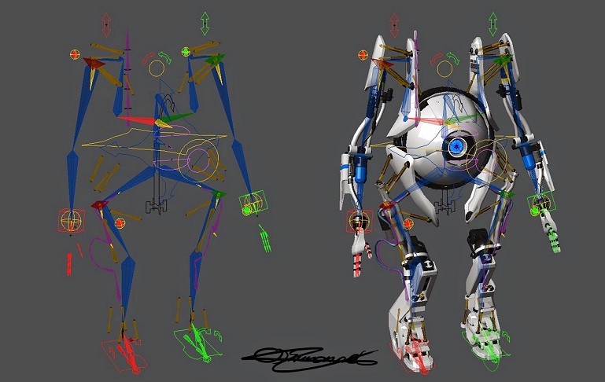

Unit 10: VFX CRAFT
=============
<!--Abstract
The processes and art of a particular department, such as animation, lighting, FX or rigging
The particular standards of a department and the challenges they face
-->
From my experience at Double Negative, I haven't worked very closely with any one *creative* department in particular, but instead I have picked up a more basic (although broader) understanding of the challenges and responsibilities of a wide range of departments. So here I will give a brief overview of each of major roles, which will exist in almost every large VFX house.

Step 1: Concept Design
-------------
Concept Design is always a vital first step of any visual creative project that requires cooperation, whether a marketing campaign, a computer game or, more importantly, visual effects. In feature films, this is where many of the sets, costumes, and creatures are often first visualized, after only previously existing as words in a screenplay and in the imagination of the director.

Concept artists might be involved from the client side, the VFX house or even both, depending on the nature of the project. They often have a wide range of creative skills, as concept might include 3D sculpts, 2D digital art and sketches.

Artists in this area are able to have a lot of creative impact, as concept work will be used time and time again as reference in the work of many other artists.

Step 2: Build (Asset Specific Work)
-------------
In this section I will cover the main departments involved in asset design.

### modelling

*image: https://seraphinacorazza.wordpress.com/2012/12/28/*

### rigging

*image: James Ball - http://ballzy247saeblog.blogspot.co.uk/2015/02/*

para

### texture & shader design

*image: Image Engine*

Step 3: Shot Specific Work
-------------
Brief overview.

### Matchmove

*image: QLBEANS*

### Animation

*image: Digital Domain*

### FX

*image: Carlos Parmentier*

### Lighting

*image: Dylan Sisson*

A lighter's role is to ignite stuff

Step 4: 2D
-------------
brief overview

### Roto

*image + in-depth tutorial: https://pirayaganjanakulnon.wordpress.com/2016/01/12/module-01-assignment-01-rotoscope-shot/*

Roto artists are responsible for creating alpha mattes from scans which isolate certain features. Ideally, a key would be easier and more efficient, but it is not always possible or practical to shoot in front of an evenly lit screen. The most common way this is done is by trying to break down the movement of the desired element in a way it can be defined by as few 2d spline-shapes as possible. Then these shapes are transformed and translated to follow the movement in the scan. Compositors can then take these elements and layer them over CG elements or combine them with other scans.

### Prep/Paint

*image: http://www.btlnews.com/crafts/visual-fx/level-256-produces-126-vfx-shots-for-the-bourne-legacy/*

Prep have the job of cleaning up scans, ready for comp, mainly by painting. Painting, in the context of Prep, refers to the skill of believably reconstructing detail in a part of a scan that has been partially or completely occluded, by sampling from similar areas on the same or surrounding frames, or reference images. Some common paint removal tasks are required for:

- Dust shadows from footage shot on physical film.
- Wires from actor harnesses.
- Accidental or unavoidable boom poles, camera rigs and film crew members.
- Items that conflict with latest creative decisions or that create continuity issues.

### Comp

*image: Iloura*

A Comper's role is to combine the work of all of the earlier artists departments into a final shot. This involves combining any CG elements, DMP (Digital Matte Painting) work, prep elements and roto mattes with live action scans, in a way that looks believable enough to fool a viewer that it was shot once, through the lens of a single real camera.

An Organised Example of a Nuke node graph:

*image: http://www.jinguanghuang.com/compositing*

The most commonly used industry compositing software package is currently Nuke, which has been developed by The Foundry since 2007. It uses a node-based system, rather than the layer-based system found in compositing software such as the also very popular Adobe After Effects. One significant advantage of the node-based workflow is that it makes collaboration much easier. You can easily get an idea of what is happening in a well-organised nuke scene by zooming out and looking at the entire node graph, something that is much more difficult to do in a layer based system, especially when you are dealing with very large scene's (which is very likely in a VFX studio).

