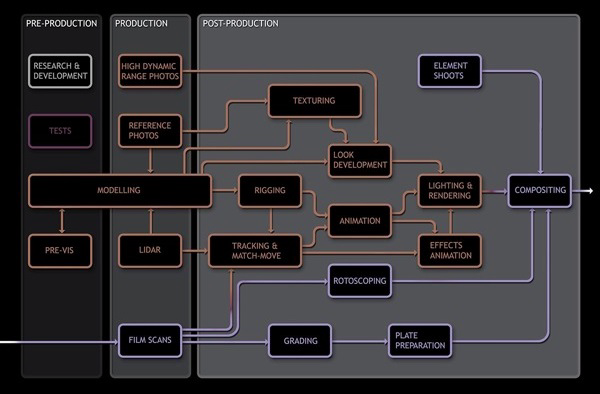

Unit 1: PIPELINE
=============
The pipeline is a term used to describe a system, made up of many different steps, for producing VFX. They have to be able to be non-linear & versatile and may differ a lot between VFX houses, depending on many different factors, not limited to:
- The size of the company.
- The talent in the company.
- The type of work expected. (e.g. Feature films, TV, Adverts..)

A typical VFX pipeline:

*image: Andrew Whitehurst*

Collaboration between artists all working with different software packages and file formats introduces the need for a new area, in companies large enough to afford them: the pipeline department. They are responsible for creating and managing custom infrastructure that aims to make interactions between different departments more efficient. 

I explore the functions of all of the major creative departments you might find in a VFX house in Unit 10 (VFX Craft). So instead, here is a brief summary of what they each might output.

|Discipline             |Output                                 |
|-----------------------|---------------------------------------|
|Onset                  |Reference photos, HDRIs, LIDAR/3D scans|
|Concept                |2D & 3D art                            |
|Modelling              |3D models                              |
|Rigging                |Deformable character rigs              |
|Texture & Shader Design|Texture maps, Shader scripts           |
|Environments/DMP       |3D geometry, Matte paintings           |
|Matchmove              |3D Cameras, Animation curves           |
|Animation              |Animation curves, Geometry caches      |
|Creature               |Geometry caches                        |
|FX                     |Geometry caches                        |
|Lighting               |Light rigs, 2D passes                  |
|Roto / Prep            |2D elements                            |
|Comp                   |2D sequences                           |

The Pipeline TD's Role
-------------
Aside from the example above, a pipeline td also has many other responsibilities. I will explain a few below.

*Note: By "Pipeline TD", I am making a generalisation and referring to a members of the pipeline department, whose titles probably differ.*

### Artist Workflow Tools
There may be some very specific tools that a show requires, or some general workflow tools that an application of choice doesn't do so well, that pipeline may be asked to develop. 

### Production Workflow Tools
In some cases, production may ask pipeline for specific tools to more easily meet their demands. 

### Meeting Production Demands
As in any business role, When faced with an issue, Pipeline TDs have to find a balance between the practical solution and the idyllic one. There can pressure to complete a script, or push some renders through as soon as possible. The TD needs to have a good enough understanding of the production, creative & technical processes at the company to realise the consequences of his actions, which he would use to inform his decisions.