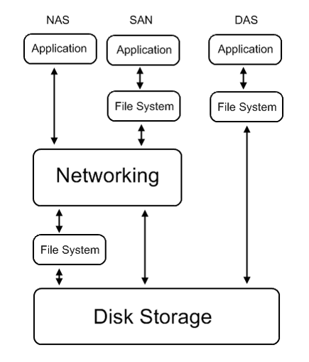

Unit 2: DATA MANAGEMENT
=============

<!-- The importance of and techniques for managing large scale on-line and near-line data storage.
Digital images and manipulation techniques. -->

Whether for streaming lossless 4k 32-bit EXRs or reading 500 gigabyte alembic caches, VFX studios require special and expensive infrastructure to enable working efficiently with such large amounts of data. They need to ensure that there is plenty of disk space for data, that there are reliable snapshot backup and archiving systems, that it is all accessible via a speedy network and that it is all protected by a hefty firewall.

Potential Storage Solutions
--------------
Here I will briefly cover the data systems that exist and are used throughout various VFX studios. 

# DAS (Direct-attached Storage)
DAS is any storage directly connected to a computer, therefore any attatched HDD or SSD is an example.

### NAS (Network-attached Storage)

### SAN (Storage Area Network)

Backups / Archiving
--------------

Data Security
--------------

*statistics are sourced from the 2017 survey published in "New Insights Into the Growing VFX Industry" by postPerspective and Quantum*  