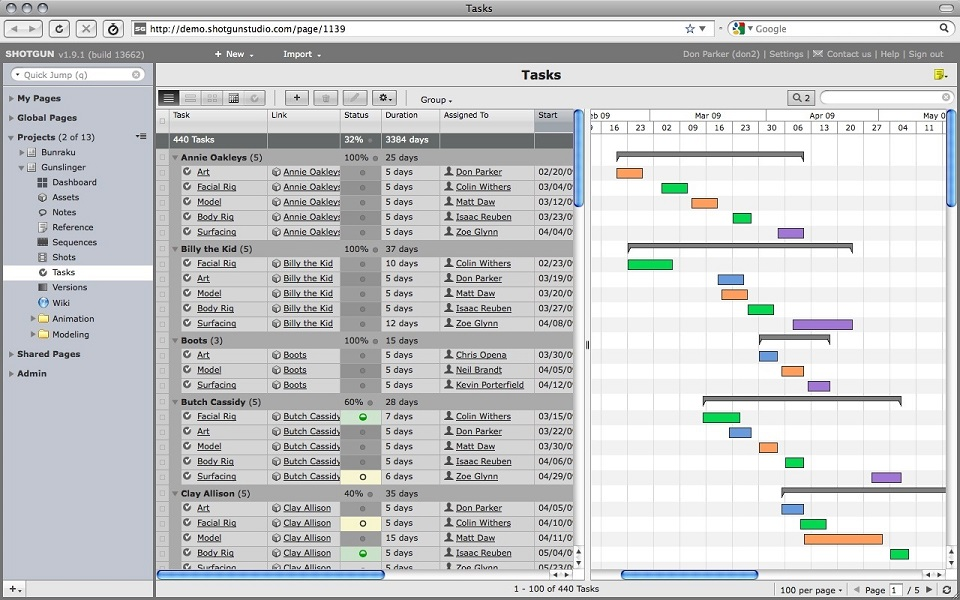

Unit 5: PROJECT ORGANISATION
=============
abstract

<!-- 
The importance of naming conventions and version control
How to ensure shots/assets can move from artist to artist (readability) -->

VFX Production
-------------
Large-scale VFX projects may require collaboration between hundreds of different people over several different sites globally, which is the reason that production teams exist. Production hold the responsibility of managing artists, liasing with clients and creating & maintaining realistic work schedules, among other things. 

One system that is popular among many VFX studios is *Shotgun*. Shotgun is primarily a project management system designed specifically for animation and VFX production, which includes an integrated asset management and versioning system. It's used by artists and production alike, with one of its major selling points being its all-in-one approach; Production can use it to easily set team milestones and distribute tasks, while artists can use it to keep track of their work and respond to all their latest notes.

Plugin/software Production
-------------
Developers