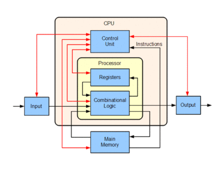

Unit 9: COMPUTING
=============

Internal Structure: Overview
-------------

### Motherboard
The motherboard is the main board which holds/connects all of the major components. They contain slots/sockets for CPUs, RAM chips, data disks, video/sound cards and peripherals. The BIOS is a firmware used for basic set-up of the system that is stored on a memory chip on the motherboard.

Internal Structure: Components
-------------
### CPU
The CPU (Central Processing Unit, Processor) is the name for the circuitry in a computer that deals almost all of the calculations and logical instructions given to it by programs. However, normally we call modern microprocessors CPUs, which actually consist of more components than a basic processing units. Modern processors often have multiple CPUs and almost always have their own incredibly fast onboard memory caches.

### GPU 
The GPU (Graphics Processing Unit/Video Card), is a specialized chip that is used to process visual output to the display device and also manage most 3D calculations. They are much better suited for dealing with large blocks of data at a time than the CPU, often utilising their own on-board RAM (VRAM). The hardware is often specialized to support certain functions such as accelerated video decoding, texture mapping and rendering.

Certain CPUs also have their own integrated graphics, which is often less powerful than a dedicated graphics card, but is completely suitable for basic tasks such as watching videos and browsing the web, but, in most cases, isn’t suited for more graphics-intensive tasks such as playing 3D games. Integrated graphics cards often use a portion of the system's RAM, which is considerably slower to access than a GPU’s VRAM. Integrated Graphics Processors can have up to 30 GB/s of memory bandwidth from the system’s RAM, compared to the 264 GB/s of bandwidth that a modern GPU might have with it’s onboard memory.

### RAM (Random Access Memory)
RAM is computer memory that is very fast to access, secondary in speed to that of the processors onboard memory caches. It is volatile, meaning that it must be powered to store data, so all data is lost once the system is shut down. 

The speed of reading & writing data is often a major bottleneck in computing systems, so a slower form of memory is only used when ultimately necessary. RAM is considerably faster than a hard drive to access, and is much larger in capacity than the storage available onboard the processor. Current program’s data and open files are stored in the RAM.

### PSU (Power Supply Unit)
This is a fairly obvious one. The power supply’s main job is to convert an AC current from the mains supply into the low-voltage DC current that the computer system uses. They often have features such as over/under-voltage, temperature and surge protections built-in. You can buy PSUs that can output a range of wattages, that are suited to different systems. The majority of the power is used by processors in the CPU and GPU, and you can often calculate the rough wattage required for your system by the sum of the required power level of these two components plus an extra 100-200W for the motherboard and extra peripherals.

### HDD/SSD (Hard Disk Drive/ Solid State Drive)
HDD’s are encased magnetic storage disks, with a read/write head on an actuator arm to access the data. They can come in a variety of form factors, today’s most common being the 3.5” and the 2.5”. 

SSD’s often come in the same standardised sizes. They use flash memory, which can be much faster to access, with speeds up to around 500 MBit/s.

They both most commonly use the SATA interface as a controller.

Network Interfaces
-------------

### Ethernet
para

### Wi-Fi
para

Network Types
-------------
There are many different network types, not exclusive to these examples:

### PAN (Personal Area Network)
para

### LAN (Local Area Network)
para

### WAN (Wide Area Network)
para

### EPN (Enterprise Private Network)
para

### VPN (Virtual Private Network)
para

